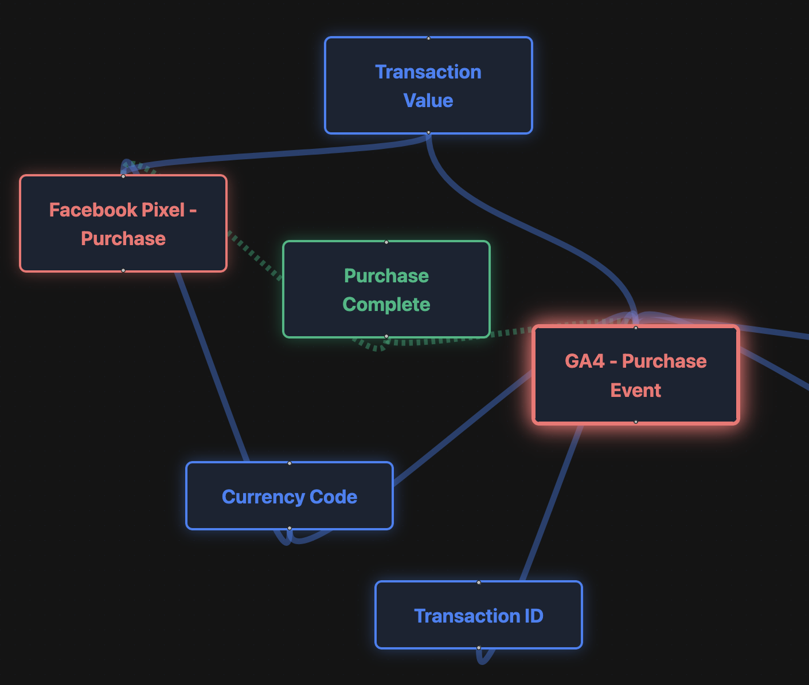

# GTM Visualizer

An interactive visualization tool for Google Tag Manager containers. Upload your GTM export JSON and see how your Tags, Triggers, and Variables are connected. The parsing is done locally in your browser, no sensitive data is being sent.



## Features

- **Interactive Graph** - Visualize your GTM container as a force-directed node graph
- **Dependency Mapping** - See relationships between Tags, Triggers, and Variables
- **Color-Coded Nodes** - Tags (red), Triggers (green), Variables (blue)
- **Selection Highlighting** - Click a node to highlight its connections
- **Mobile Support** - Bottom sheet inspector with swipe gestures
- **Dark/Light Mode** - Toggle between themes
- **Privacy First** - All processing happens locally in your browser

## How to Use

1. Export your GTM container as JSON (Admin → Export Container)
2. Upload the JSON file or drag & drop
3. Explore your container structure visually
4. Click nodes to inspect their configuration

## Getting Started (Development)

```bash
# Install dependencies
npm install

# Start dev server
npm run dev

# Start with network access (for mobile testing)
npm run dev -- --host

# Build for production
npm run build
```

## Tech Stack

- React 19 + TypeScript
- Vite
- React Flow (@xyflow/react)
- D3-force for layout
- Tailwind CSS
